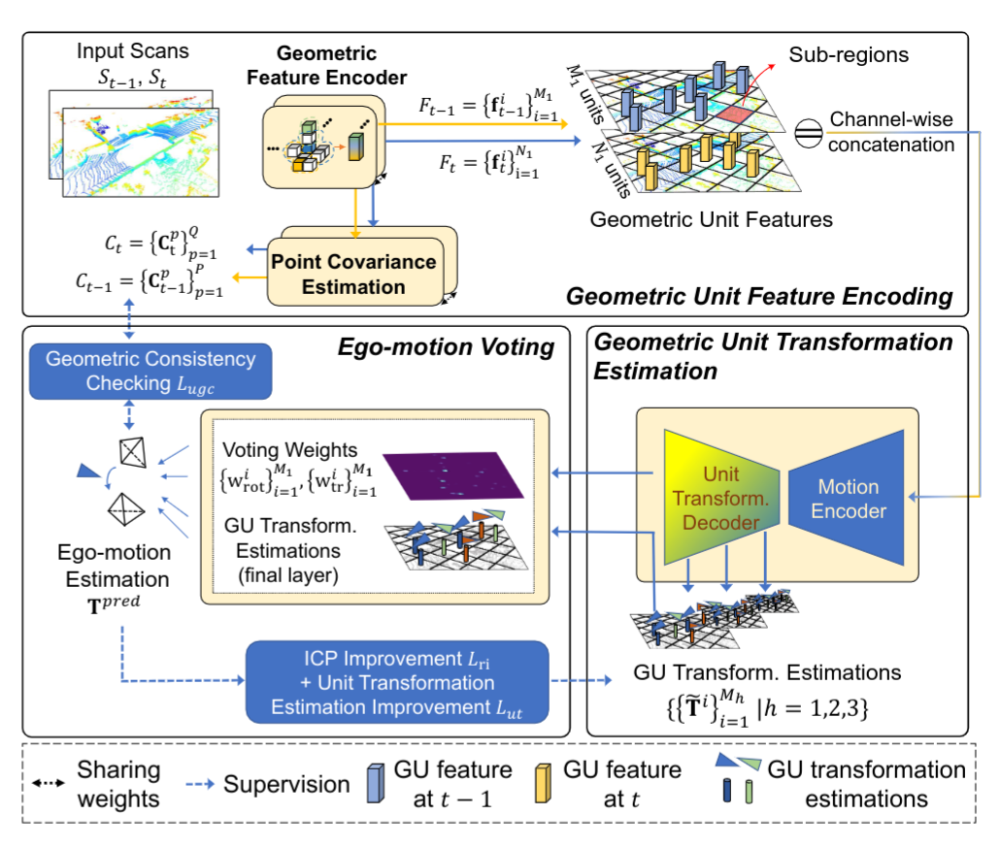
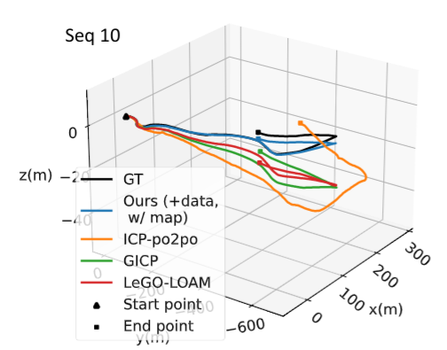
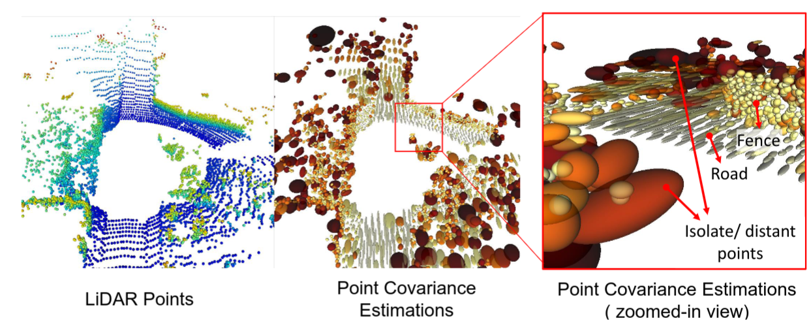

# RSLO
The code for our work **"Robust Self-supervised LiDAR Odometry via Representative Structure Discovery and 3D Inherent Error Distribution Modeling"** 

<p align="center">
 
</p>

<!--  -->


## Framework 
The self-supervised two-frame odometry network contains three main modules including the Geometric Unit Feature Encoding module, Geometric Unit Transformation Estimation module and the Ego-motion voting module. 

<!--  -->
<p align="center">

</p>

## Estimated Trajectories and Point Covariance Estimations
The comparison (on estimated trajectories) of our method with other competitive baselines (left).  The visualization of our estimated point covariances (right). 
<!-- <figure class="image"> -->

<!-- <p align="center"> -->
<figure class="half">
   
  </figure>
<!-- </p> -->


## Installation 
As the dependencies is complex, a dockerfile has been provide. You need to install [docker](https://docs.docker.com/get-docker/) and [nvidia-docker2](https://github.com/NVIDIA/nvidia-docker) first and then set up the docker image and start up a container with the following commands: 

```
cd RSLO
sudo docker build -t rslo .    
sudo docker run  -it  --runtime=nvidia --ipc=host  --volume="HOST_VOLUME_YOU_WANT_TO_MAP:DOCKER_VOLUME"  -e DISPLAY=$DISPLAY -e QT_X11_NO_MITSHM=1  rslo bash

```

## Data Preparation
You need to download the [KITTI odometry dataset](http://www.cvlibs.net/datasets/kitti/eval_odometry.php) and unzip them into the below directory structures. 
```
./kitti/dataset
|──sequences
|    ├── 00/           
|    |   ├── calib.txt	
|    │   ├── velodyne/	
|    |   |	├── 000000.bin
|    |   |	├── 000001.bin
|    |   |	└── ...
|    ├── 01/ 
|    |   ...
|    └── 21/
└──poses
    |──00.txt
    |──01.txt
    |    ...
    └──10.txt

```
Then, create hdf5 data with 
```
python script create_hdf5.py ./kitti/dataset ./kitti/dataset/all.h5
```

## Test with the Pretrained Models
The trained models on the KITTI dataset have been uploaded to the [OneDrive](https://1drv.ms/u/s!AgP7bY0L6pvta-AeCK1tFxJrn-8?e=1hYWzy). You can download them and put them into the directory "weights" for testing. 

```
export PYTHONPATH="$PROJECT_ROOT_PATH:$PYTHONPATH"
export PYTHONPATH="$PROJECT_ROOT_PATH/rslo:$PYTHONPATH"
python -u  $PROJECT_ROOT_PATH/evaluate.py multi_proc_eval \
        --config_path $PROJECT_ROOT_PATH/config/kitti_eval_ours.prototxt \
        --model_dir ./outputs/ \
        --use_dist True \
        --gpus_per_node 1 \
        --use_apex True \
        --world_size 1 \
        --dist_port 20000 \
        --pretrained_path $PROJECT_ROOT_PATH/weights/ours.tckpt \
        --refine False \
```
Note that you need to specify the PROJECT_ROOT_PATH, i.e. the absolute directory of the project folder "RSLO" and modify the path to the created data, i.e. all.h5, in the configuration file kitti_eval_ours.prototxt before running the above commands. A bash script "script/eval_ours.sh" is provided for reference. 

## Training from Scratch
A basic training script demo is shown as below. You can increase the GPU number, i.e. the variable "GPUs", according to your available resources. Generally, larger batch sizes produce stabler training procedures and better final performances.


```
export PYTHONPATH="$PROJECT_ROOT_PATH:$PYTHONPATH"
export PYTHONPATH="$PROJECT_ROOT_PATH/rslo:$PYTHONPATH"
GPUs=1 # the number of gpus you use 
python -u  $PROJECT_ROOT_PATH/train_hdf5.py multi_proc_train \
        --config_path $PROJECT_ROOT_PATH/config/kitti_train_ours.prototxt \
        --model_dir ./outputs/ \
        --use_dist True \
        --gpus_per_node $GPUs \
        --use_apex True \
        --world_size $GPUs \
        --dist_port 20000 \
        --refine False \

```

<!-- Please see [training](./doc/train.md) for more details. -->

## TODO List and ETA
- [x] Inference code and pretrained models (9/10/2022)
- [x] Training code (10/12/2022)
- [ ] Code cleaning and refactor 


## Acknowledgments
We thank for the open-sourced codebases [spconv](https://github.com/traveller59/spconv) and [second](https://github.com/traveller59/second.pytorch) 


